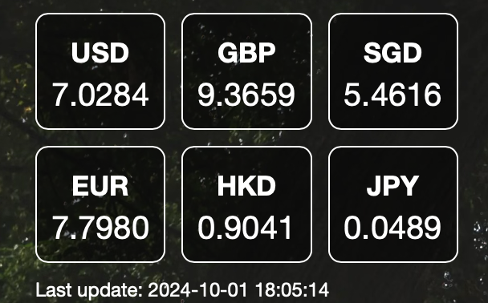

# Exchange Rates Widget for Übersicht



## Overview

The **Exchange Rates Widget** is a customizable [Übersicht](http://tracesof.net/uebersicht/) widget that displays real-time exchange rates from multiple source currencies to a single target currency. It's designed to be lightweight, visually appealing, and easy to configure according to your preferences.

## Features

- **Customizable Currencies**: Easily select which source currencies (`from_currencies`) you want to track and set your desired target currency (`to_currency`).
- **Real-Time Data**: Fetches up-to-date exchange rates from the [Open Exchange Rates API](https://openexchangerates.org/).
- **Automatic Updates**: The widget updates the exchange rates every hour to ensure accuracy.
- **Last Update Timestamp**: Displays the last time the exchange rates were updated.
- **Stylish Design**: Comes with a sleek, customizable design that blends seamlessly with your desktop.

## Installation

1. **Download the Widget**

   - Download the `ExchangeRates.widget.zip` file from this repository.

2. **Install the Widget**

   - Unzip the `ExchangeRates.widget.zip` file if your system doesn't automatically do so.
   - Move the `ExchangeRates.widget` folder to your Übersicht widgets directory, usually located at `~/Library/Application Support/Übersicht/widgets/`.

3. **Obtain an API Key**

   - Sign up for a free account at [Open Exchange Rates](https://openexchangerates.org).
   - Obtain your `app_id` (API key) from the dashboard after registration.

4. **Configure the Widget**

   - Open the `ExchangeRates.coffee` file located inside the `ExchangeRates.widget` folder with a text editor.
   - Replace `"YOUR_APP_ID_HERE"` with your actual `app_id` from Open Exchange Rates.

     ```coffeescript
     # Your Open Exchange Rates API key.
     app_id: "YOUR_APP_ID_HERE"  # Replace with your actual app_id.
     ```

   - Optionally, modify the `from_currencies` and `to_currency` variables to your desired currencies.

     ```coffeescript
     # Source currencies to display.
     from_currencies: ["USD", "GBP", "SGD", "EUR", "HKD", "JPY"]
  
     # Target currency for conversion.
     to_currency: "CNY"
     ```

5. **Refresh Übersicht**

   - Open Übersicht or refresh it if it's already running to see the widget on your desktop.

## Customization

- **Changing Currencies**

  - Edit the `from_currencies` array to include the currency codes you wish to track.
  - Change the `to_currency` variable to set your desired target currency.

- **Adjusting Refresh Frequency**

  - Modify the `refreshFrequency` variable to change how often the widget updates (in milliseconds).

    ```coffeescript
    # Data refresh frequency (in milliseconds). Default is 1 minute.
    refreshFrequency: 60 * 1000  # Adjust as needed.
    ```

- **Styling the Widget**

  - Customize the CSS in the `style` section of the `ExchangeRates.coffee` file to change the appearance of the widget.

    ```coffeescript
    style: """
      .exchange-rate-container
        position: absolute
        top: 29px
        left: 29px
        color: #fff
        font-family: 'Helvetica Neue'
      ...
    """
    ```
